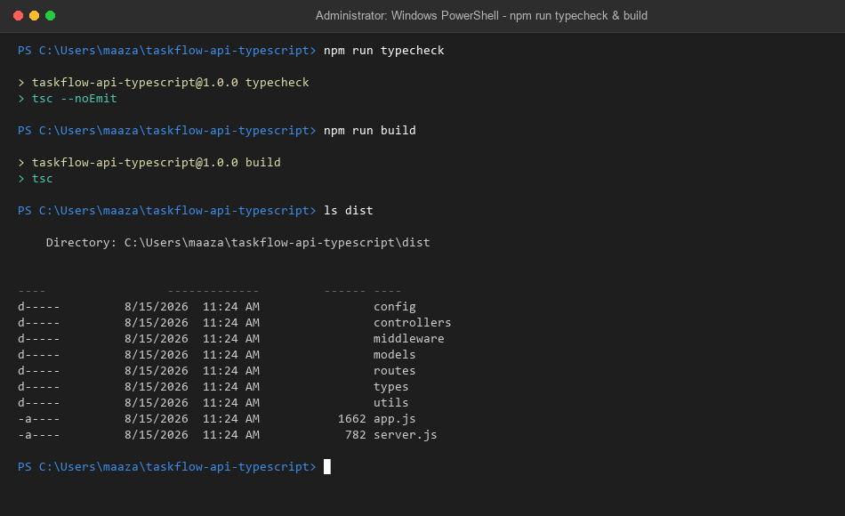

# TaskFlow API — TypeScript

This is the [TaskFlow API](https://github.com/MaazzAlii/taskflow-api-express-mongodb-jwt) (originally plain JavaScript) migrated to TypeScript, with **strict mode enabled** and **no implicit `any`** anywhere in the project.

## Acceptance Criteria

- ✅ **Express routes typed with TypeScript** — every route handler, middleware, and controller has explicit types for `Request`/`Response`, request bodies, and route params (see `src/types/index.ts` for the shared `AuthRequest` type)
- ✅ **At least one generic type created and used** — two, actually:
  - `ApiResponse<T>` (`src/types/index.ts`) — a generic response envelope used across every controller, so `ApiResponse<ITask>`, `ApiResponse<ITask[]>`, `ApiResponse<ICategory>` etc. all get full type-safety on the `data` payload instead of `any`.
  - `asyncHandler<R extends Request>` (`src/utils/asyncHandler.ts`) — a generic wrapper for async route handlers that removes repetitive try/catch while keeping the specific request type (e.g. `AuthRequest`) intact.
- ✅ **No implicit `any`** — `tsconfig.json` has `"strict": true` and `"noImplicitAny": true`. `npx tsc --noEmit` passes with zero errors.

## What Changed From the JS Version

- All `.js` files converted to `.ts`, moved under `src/`.
- Mongoose models now export a `Document`-extending interface (`IUser`, `ITask`, `ICategory`) alongside the schema, so every query result is fully typed instead of `any`.
- `AuthRequest` (extends Express's `Request`) carries a typed `user?: IUser`, replacing the untyped `req.user` from the JS version.
- JWT signing/verifying is typed (`SignOptions`, a `DecodedToken` interface) instead of relying on `jsonwebtoken`'s loose default typing.
- Centralized error handling now uses a typed `AppError` interface instead of catching bare `Error`.
- Build step added: `tsc` compiles `src/` → `dist/`; `ts-node-dev` is used for hot-reload in development.

## Tech Stack

Express 4, Mongoose 8, TypeScript 5 (strict), jsonwebtoken, bcryptjs, cors, dotenv, ts-node-dev.

## Project Structure

```
taskflow-api-typescript/
├── api/index.ts          # Vercel serverless entry point (compiled by @vercel/node directly)
├── src/
│   ├── app.ts              # Express app instance
│   ├── server.ts            # Entry point for local dev/production
│   ├── config/db.ts          # MongoDB connection
│   ├── types/index.ts         # Shared types: ApiResponse<T>, AuthRequest, TaskStatus, UserRole
│   ├── models/                 # Mongoose schemas + Document interfaces (IUser, ITask, ICategory)
│   ├── middleware/               # protect/authorize (auth.ts), notFound/errorHandler (errorHandler.ts)
│   ├── controllers/                # business logic, typed request bodies and responses
│   ├── routes/                      # Express routers
│   └── utils/
│       ├── asyncHandler.ts           # generic async handler wrapper
│       └── generateToken.ts           # typed JWT signing
├── tsconfig.json           # strict: true, noImplicitAny: true
└── package.json
```

## Setup

```bash
git clone <your-repo-url>
cd taskflow-api-typescript
npm install
cp .env.example .env   # fill in MONGO_URI and JWT_SECRET
npm run dev             # ts-node-dev with hot reload
```

## Scripts

| Command | Description |
|---|---|
| `npm run dev` | Hot-reload dev server via `ts-node-dev` |
| `npm run build` | Compiles `src/` → `dist/` via `tsc` |
| `npm start` | Runs the compiled output (`node dist/server.js`) — run `build` first |
| `npm run typecheck` | Type-checks the whole project with no output (`tsc --noEmit`) |

## Environment Variables

Same as the original JS version — `PORT`, `MONGO_URI`, `JWT_SECRET`, `JWT_EXPIRES_IN`, `NODE_ENV`. See `.env.example`.

## API Reference

Identical routes and behavior to the original JS version — see the [original repo's README](https://github.com/MaazzAlii/taskflow-api-express-mongodb-jwt) for the full endpoint table. This migration changes types, not behavior; verified with an automated test pass covering the health check, 404 handling, auth guards on protected routes, and input validation — all passing identically to the JS version.

## Deployment (Vercel)

`api/index.ts` is the serverless entry point — Vercel's `@vercel/node` builder compiles TypeScript directly, no separate build step needed for the deployed function itself (though `npm run build` still exists for running the compiled app outside Vercel).

1. Push to GitHub.
2. Vercel → New Project → import the repo.
3. Add environment variables: `MONGO_URI`, `JWT_SECRET`, `JWT_EXPIRES_IN`, `NODE_ENV=production`.
4. Deploy.

## Verification

The TypeScript migration has been verified with strict mode type checking (`tsc --noEmit`) and build compilation (`tsc`).

```bash
$ npm run typecheck

> taskflow-api-typescript@1.0.0 typecheck
> tsc --noEmit

$ npm run build

> taskflow-api-typescript@1.0.0 build
> tsc
```



